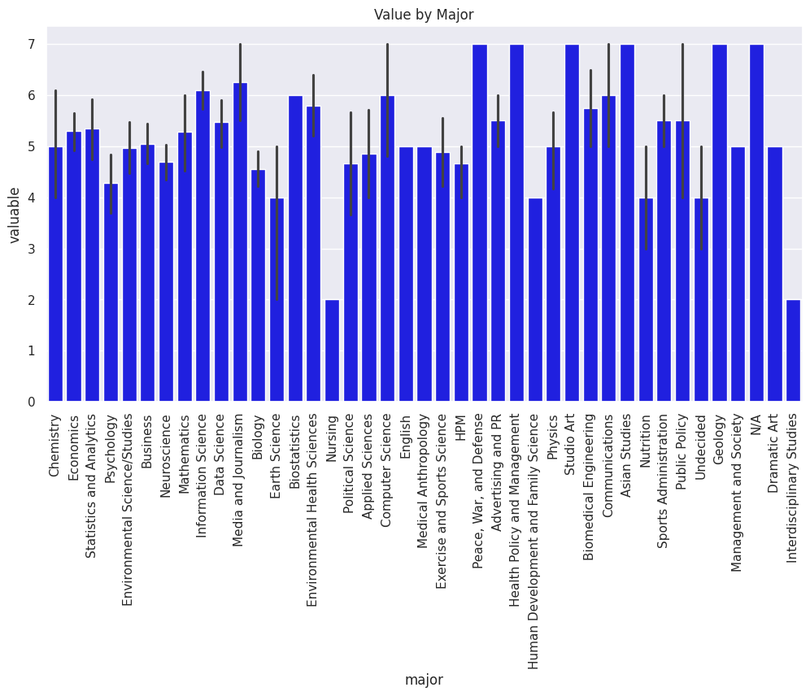
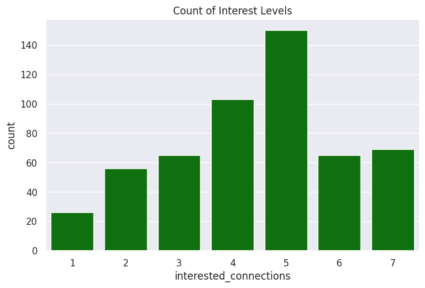
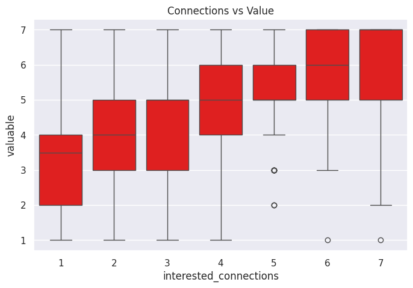

---
# Do not edit the text between these lines!
layout: default
---

# Analysis: Student Motivation and Course Value

## Summary

In this project, we explored the relationship between a student's major and their percieved value of learning programming. My goal was to determine if students in certain disciplines did not feel as though they could apply what was taught in COMP110 into their major or future career path.

Using survey data from COMP110, we used different aspects of those surveyed and the numerical values of Likert scales from questions to get a graphical depiction of their percieved value of programming skills for their majors.

## Visual Analysis

### 1. Perception of Value by Major

I will start my analysis by looking at how "Perceived Value" differs across different majors. If students in non-CS disciplines find the course less valuable, it supports my idea that we need real-world examples earlier to bridge that gap.

### 2. Distribution of Interest

I will create a bar chart that shows the relationship between interest in connections and course value. This helps me see if students are actually asking for real-world content, or if few people care.

### 3. Correlation: Interest vs. Value

I will create a box plot that shows if there is a link between interest and value. I want to see if students with a high interest in connections also give the coures a high value score.

## Conclusion

My analysis of whether a student’s major affects their perception of course value is ultimately inconclusive. Chart 1 showed that while I expected non-CS majors to find the course less valuable, almost all majors reported high scores in the 5–7 range. The two majors that scored lower had very small sample sizes, meaning their averages might be more innacurate. Chart 2 had a fairly normal distribution, with a slight lean to the right and the mode being at about 5 on the interested connections. This shows that the class is somewhat motivated by interdisciplinary topics. Chart 3 actually supports the hypothesis of my data, as a line of best fit would be going comfortably up. Also, in my custom analysis, it was revealed that a significant portion of the class is in the high interest category. This means that people who are interested in connections are often also finding the course valueable. The results are inconclusive because while "interest in connections" correlates with value, "student major" does not seem to correlate much with interest.

To build more confidence for my analysis, I would recommend a more targeted data collection column. Specifically, something like "career_alignment" on the Likert Scale may be useful, asking a question such as: "To what extent do you believe the programming skills in this course will be essential to your future career?" This would help "clarify" students more in different majors, such as a biology major going into medical cchool or being a biotech. These are completely different fields, with one needing computer programming much more than the other. This would clarify the difference between career utility and major connection interest.

### Potential Costs, Trade-Offs, or Negative Impacts

#### Teachers and TA's (stakeholders): 
Creating quality, interdisciplinary assignments requires significant time and potential collaboration with other departments. This increases the workload for these Professors and TAs.

#### Students (stakeholders): 
There is a potential cost in a heavy and sometimes inefficient workload. If the real-world examples are too complex, students might spend too much time on the non-CS content than the actual programming content, which could negatively impact their learning.

#### Programming content trade-off: 
More time spent on "connections" and real-world examples means less time for pure computer science theory or more advanced coding techniques.